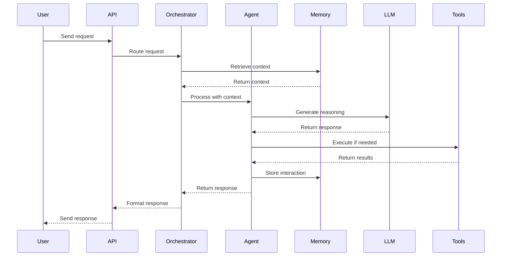

# Design Document

## Overview

This document outlines the technical design for a comprehensive AI Agent system that implements all 20 requirements from the roadmap. The system follows a modular, layered architecture that separates concerns and enables scalability, maintainability, and extensibility.

The AI Agent system will be built using Python with LangChain as the primary framework, leveraging its robust ecosystem for agent development, tool integration, and memory management. The system will support multiple LLM providers (OpenAI GPT-4, Anthropic Claude) and include advanced features such as multi-step reasoning, safety filtering, multimodal capabilities, and continuous learning.

## Architecture

### High-Level Architecture

The system follows a layered architecture with clear separation of concerns:

```
┌─────────────────────────────────────────────────────────────┐
│                     API Layer (FastAPI)                      │
│  - REST endpoints  - Authentication  - Rate limiting         │
└─────────────────────────────────────────────────────────────┘
                              │
┌─────────────────────────────────────────────────────────────┐
│                    Orchestration Layer                       │
│  - Request routing  - Session management  - Error handling   │
└─────────────────────────────────────────────────────────────┘
                              │
┌─────────────────────────────────────────────────────────────┐
│                      Agent Core Layer                        │
│  ┌──────────────┐  ┌──────────────┐  ┌──────────────┐      │
│  │   Reasoning  │  │    Memory    │  │    Safety    │      │
│  │    Engine    │  │   Manager    │  │    Filter    │      │
│  └──────────────┘  └──────────────┘  └──────────────┘      │
│  ┌──────────────┐  ┌──────────────┐  ┌──────────────┐      │
│  │     Tool     │  │   Context    │  │   Prompt     │      │
│  │   Manager    │  │   Injector   │  │   Manager    │      │
│  └──────────────┘  └──────────────┘  └──────────────┘      │
└─────────────────────────────────────────────────────────────┘
                              │
┌─────────────────────────────────────────────────────────────┐
│                    Integration Layer                         │
│  ┌──────────────┐  ┌──────────────┐  ┌──────────────┐      │
│  │     LLM      │  │    Vector    │  │   External   │      │
│  │   Provider   │  │   Database   │  │     APIs     │      │
│  └──────────────┘  └──────────────┘  └──────────────┘      │
└─────────────────────────────────────────────────────────────┘
                              │
┌─────────────────────────────────────────────────────────────┐
│                   Monitoring & Analytics                     │
│  - Metrics  - Logging  - Tracing  - Feedback collection     │
└─────────────────────────────────────────────────────────────┘
```

### Component Interaction Flow



## Components and Interfaces

### 1. API Layer

**Purpose**: Expose the agent functionality through RESTful endpoints

**Key Components**:
- `APIServer`: FastAPI application with endpoint definitions
- `AuthMiddleware`: Handle authentication and authorization
- `RateLimiter`: Prevent abuse and manage quotas
- `RequestValidator`: Validate incoming requests

**Interfaces**:
```python
class AgentAPI:
    def chat(request: ChatRequest) -> ChatResponse
    def stream_chat(request: ChatRequest) -> StreamingResponse
    def get_session(session_id: str) -> SessionInfo
    def clear_session(session_id: str) -> StatusResponse
    def get_capabilities() -> CapabilitiesResponse
```

### 2. Orchestration Layer

**Purpose**: Coordinate request processing and manage agent lifecycle

**Key Components**:
- `RequestOrchestrator`: Route and manage request flow
- `SessionManager`: Handle user sessions and state
- `ErrorHandler`: Centralized error handling and recovery

**Interfaces**:
```python
class RequestOrchestrator:
    def process_request(request: AgentRequest) -> AgentResponse
    def handle_streaming(request: AgentRequest) -> Iterator[AgentResponse]
    def recover_from_error(error: Exception, context: Context) -> AgentResponse
```

### 3. Agent Core Layer

#### 3.1 Reasoning Engine

**Purpose**: Implement multi-step reasoning and decision-making logic

**Key Components**:
- `ReasoningEngine`: Core reasoning logic using LangChain agents
- `TaskDecomposer`: Break complex tasks into steps
- `StepExecutor`: Execute individual reasoning steps
- `ProgressTracker`: Monitor multi-step execution

**Interfaces**:
```python
class ReasoningEngine:
    def reason(query: str, context: Context) -> ReasoningResult
    def decompose_task(task: str) -> List[Step]
    def execute_step(step: Step, state: State) -> StepResult
    def should_continue(state: State) -> bool
```

#### 3.2 Memory Manager

**Purpose**: Handle short-term and long-term memory storage and retrieval

**Key Components**:
- `MemoryManager`: Coordinate memory operations
- `ShortTermMemory`: Conversation buffer for active sessions
- `LongTermMemory`: Persistent storage with vector database
- `MemoryRetriever`: Semantic search and retrieval

**Interfaces**:
```python
class MemoryManager:
    def store_interaction(interaction: Interaction) -> None
    def retrieve_context(query: str, limit: int) -> List[Memory]
    def get_conversation_history(session_id: str) -> List[Message]
    def cleanup_old_memories(threshold: datetime) -> int
```

#### 3.3 Safety Filter

**Purpose**: Prevent harmful, biased, or inappropriate content

**Key Components**:
- `SafetyFilter`: Main filtering logic
- `ContentModerator`: Check for inappropriate content
- `BiasDetector`: Identify and reduce biased outputs
- `PolicyEnforcer`: Apply safety policies

**Interfaces**:
```python
class SafetyFilter:
    def filter_input(text: str) -> FilterResult
    def filter_output(text: str) -> FilterResult
    def check_bias(text: str) -> BiasScore
    def enforce_policy(content: str, policy: Policy) -> bool
```

#### 3.4 Tool Manager

**Purpose**: Manage external tool integrations and execution

**Key Components**:
- `ToolManager`: Register and manage tools
- `ToolExecutor`: Execute tool calls with retry logic
- `ToolRegistry`: Catalog of available tools
- `APIClient`: Generic API client with authentication

**Interfaces**:
```python
class ToolManager:
    def register_tool(tool: Tool) -> None
    def execute_tool(tool_name: str, params: Dict) -> ToolResult
    def list_tools() -> List[ToolInfo]
    def should_use_tool(context: Context) -> Optional[str]
```

#### 3.5 Context Injector

**Purpose**: Inject relevant context into agent requests

**Key Components**:
- `ContextInjector`: Main context injection logic
- `StaticContextProvider`: Load unchanging reference material
- `DynamicContextProvider`: Generate request-specific context
- `ContextFilter`: Remove irrelevant information

**Interfaces**:
```python
class ContextInjector:
    def inject_context(request: Request) -> EnrichedRequest
    def get_static_context(domain: str) -> str
    def get_dynamic_context(request: Request) -> str
    def filter_context(context: str, relevance_threshold: float) -> str
```

#### 3.6 Prompt Manager

**Purpose**: Manage prompt templates and generation

**Key Components**:
- `PromptManager`: Template management
- `PromptTemplate`: Structured prompt with variables
- `PromptRenderer`: Render templates with data
- `PromptOptimizer`: Minimize token usage

**Interfaces**:
```python
class PromptManager:
    def get_template(name: str) -> PromptTemplate
    def render_prompt(template: str, variables: Dict) -> str
    def create_template(name: str, template: str) -> None
    def optimize_prompt(prompt: str) -> str
```

### 4. Integration Layer

#### 4.1 LLM Provider

**Purpose**: Abstract LLM API interactions

**Key Components**:
- `LLMProvider`: Abstract base class
- `OpenAIProvider`: GPT-4 integration
- `AnthropicProvider`: Claude integration
- `TokenTracker`: Monitor token usage

**Interfaces**:
```python
class LLMProvider:
    def generate(prompt: str, config: ModelConfig) -> str
    def stream_generate(prompt: str, config: ModelConfig) -> Iterator[str]
    def count_tokens(text: str) -> int
    def get_cost(tokens: int) -> float
```

#### 4.2 Vector Database

**Purpose**: Store and retrieve embeddings for semantic search

**Key Components**:
- `VectorStore`: Abstract vector database interface
- `PineconeStore`: Pinecone implementation
- `EmbeddingGenerator`: Generate embeddings from text

**Interfaces**:
```python
class VectorStore:
    def store(id: str, embedding: List[float], metadata: Dict) -> None
    def search(query_embedding: List[float], limit: int) -> List[SearchResult]
    def delete(id: str) -> None
    def update_metadata(id: str, metadata: Dict) -> None
```

#### 4.3 External APIs

**Purpose**: Integrate with external services

**Key Components**:
- `APIRegistry`: Catalog of external APIs
- `HTTPClient`: HTTP client with retry and timeout
- `AuthManager`: Handle API authentication
- `RateLimitHandler`: Respect API rate limits

### 5. Monitoring & Analytics

**Purpose**: Track performance, errors, and user feedback

**Key Components**:
- `MetricsCollector`: Collect performance metrics
- `Logger`: Structured logging
- `Tracer`: Distributed tracing
- `FeedbackCollector`: Gather user feedback

**Interfaces**:
```python
class MetricsCollector:
    def record_latency(operation: str, duration: float) -> None
    def record_error(error: Exception, context: Dict) -> None
    def record_feedback(session_id: str, rating: int) -> None
    def get_metrics(time_range: TimeRange) -> Metrics
```

## Data Models

### Core Models

```python
@dataclass
class AgentRequest:
    session_id: str
    user_id: str
    message: str
    context: Optional[Dict] = None
    multimodal_inputs: Optional[List[MultimodalInput]] = None
    preferences: Optional[UserPreferences] = None

@dataclass
class AgentResponse:
    session_id: str
    message: str
    reasoning_steps: List[ReasoningStep]
    tool_calls: List[ToolCall]
    confidence: float
    multimodal_outputs: Optional[List[MultimodalOutput]] = None

@dataclass
class Memory:
    id: str
    session_id: str
    content: str
    embedding: List[float]
    timestamp: datetime
    metadata: Dict

@dataclass
class Tool:
    name: str
    description: str
    parameters: Dict[str, ParameterSpec]
    execute: Callable
    requires_auth: bool

@dataclass
class ReasoningStep:
    step_number: int
    description: str
    action: str
    result: Any
    confidence: float
    timestamp: datetime

@dataclass
class UserProfile:
    user_id: str
    preferences: Dict
    communication_style: str
    interaction_history: List[str]
    created_at: datetime
    updated_at: datetime
```

### Configuration Models

```python
@dataclass
class ModelConfig:
    provider: str  # "openai", "anthropic"
    model_name: str
    temperature: float = 0.7
    max_tokens: int = 2000
    top_p: float = 1.0
    frequency_penalty: float = 0.0
    presence_penalty: float = 0.0

@dataclass
class AgentConfig:
    model_config: ModelConfig
    max_reasoning_steps: int = 10
    enable_tools: bool = True
    enable_memory: bool = True
    enable_safety_filter: bool = True
    cache_responses: bool = True
    parallel_tool_execution: bool = False
```


## Correctness Properties

*A property is a characteristic or behavior that should hold true across all valid executions of a system—essentially, a formal statement about what the system should do. Properties serve as the bridge between human-readable specifications and machine-verifiable correctness guarantees.*

### Property 1: Plugin registration and execution
*For any* custom tool or module that is registered with the system, invoking that tool should successfully execute and return a result
**Validates: Requirements 2.2, 2.3**

### Property 2: LLM authentication consistency
*For any* LLM API call, the system should include valid authentication credentials in the request headers
**Validates: Requirements 3.2**

### Property 3: Token usage tracking
*For any* LLM API call, the system should record the token count used in that call
**Validates: Requirements 3.3**

### Property 4: Model parameter propagation
*For any* set of model configuration parameters, those parameters should be correctly passed to the LLM API
**Validates: Requirements 3.4**

### Property 5: LLM error handling
*For any* LLM API error (rate limit, timeout, invalid request), the system should handle it gracefully without crashing
**Validates: Requirements 3.5**

### Property 6: Safety filter blocking
*For any* content that violates safety policies, the safety filter should block it and prevent it from being returned to the user
**Validates: Requirements 4.4, 12.1, 12.3**

### Property 7: External API invocation
*For any* registered external API tool, when invoked with valid parameters, the system should successfully make the API call
**Validates: Requirements 5.1**

### Property 8: Credential security
*For any* API credential stored in the system, it should not appear in logs or user-facing responses
**Validates: Requirements 5.2**

### Property 9: API authentication headers
*For any* external API call requiring authentication, the system should include the appropriate authentication headers
**Validates: Requirements 5.3**

### Property 10: Retry logic execution
*For any* failed API call, the system should retry the call up to the configured maximum number of attempts
**Validates: Requirements 5.4**

### Property 11: Tool invocation logging
*For any* external tool call, the system should log the tool name, parameters, and timestamp
**Validates: Requirements 5.5, 10.5**

### Property 12: Request validation
*For any* incoming user request, the system should validate required fields and reject invalid requests with appropriate error messages
**Validates: Requirements 6.2**

### Property 13: Response formatting
*For any* agent response, it should conform to the defined response schema with all required fields present
**Validates: Requirements 6.4**

### Property 14: Error handling without crashes
*For any* error condition (invalid input, API failure, timeout), the system should handle it gracefully and return an error response without crashing
**Validates: Requirements 6.5**

### Property 15: Short-term memory retrieval
*For any* active conversation session, the system should retrieve recent messages from short-term memory when processing new requests
**Validates: Requirements 7.1**

### Property 16: Long-term memory persistence
*For any* data stored in long-term memory, it should persist across sessions and be retrievable by session ID or user ID
**Validates: Requirements 7.2**

### Property 17: Vector database round-trip
*For any* text content stored in the vector database, storing and then retrieving it by semantic similarity should return the original content
**Validates: Requirements 7.3**

### Property 18: Memory cleanup execution
*For any* memory older than the configured retention period, the cleanup process should remove it from storage
**Validates: Requirements 7.4**

### Property 19: Sensitive data protection
*For any* sensitive information (passwords, API keys, PII) stored in memory, it should be encrypted or masked
**Validates: Requirements 7.5**

### Property 20: Template variable substitution
*For any* prompt template with variables, rendering the template with variable values should correctly substitute all variables
**Validates: Requirements 8.2**

### Property 21: Static context inclusion
*For any* request that requires static context, the injected context should include the configured static reference material
**Validates: Requirements 9.1**

### Property 22: Dynamic context generation
*For any* request, the system should generate and include request-specific dynamic context
**Validates: Requirements 9.2**

### Property 23: Context filtering effectiveness
*For any* context with irrelevant information, the filtering process should reduce the context size while retaining relevant content
**Validates: Requirements 9.3**

### Property 24: Session context continuity
*For any* multi-turn conversation, context from previous turns should be available in subsequent requests
**Validates: Requirements 9.4**

### Property 25: User profile context inclusion
*For any* user with a stored profile, requests from that user should include their profile data in the context
**Validates: Requirements 9.5**

### Property 26: Tool invocation on demand
*For any* agent request that requires external data, the system should invoke the appropriate tool to fetch that data
**Validates: Requirements 10.1**

### Property 27: Tool failure handling
*For any* tool call that fails, the system should return an error response that informs the user of the failure
**Validates: Requirements 10.2**

### Property 28: Rate limit enforcement
*For any* API with rate limits, the system should prevent calls that would exceed the rate limit
**Validates: Requirements 10.4**

### Property 29: Task decomposition
*For any* complex task, the reasoning engine should break it down into multiple sequential steps
**Validates: Requirements 11.1**

### Property 30: Progress tracking
*For any* multi-step reasoning process, the system should record progress information for each completed step
**Validates: Requirements 11.2**

### Property 31: Step failure recovery
*For any* reasoning step that fails, the system should attempt error recovery or backtracking
**Validates: Requirements 11.4**

### Property 32: Parallel step execution
*For any* set of independent reasoning steps, the system should execute them in parallel when configured to do so
**Validates: Requirements 11.5**

### Property 33: Bias detection
*For any* agent output, the bias detector should analyze it and flag content that exceeds the bias threshold
**Validates: Requirements 12.2**

### Property 34: Safety filter logging
*For any* safety filter activation, the system should log the event with the filtered content and reason
**Validates: Requirements 12.4**

### Property 35: Quality metrics recording
*For any* agent response, the system should record quality metrics such as relevance and correctness scores
**Validates: Requirements 13.1**

### Property 36: Latency measurement
*For any* request, the system should measure and log the total response latency
**Validates: Requirements 13.2**

### Property 37: Error logging completeness
*For any* error that occurs, the system should log it with timestamp, error type, stack trace, and context information
**Validates: Requirements 13.3**

### Property 38: Feedback storage
*For any* user feedback submission, the system should store it with the associated session ID and timestamp
**Validates: Requirements 13.4**

### Property 39: Response caching
*For any* query that has been processed before, the system should return the cached response if caching is enabled
**Validates: Requirements 14.2**

### Property 40: Asynchronous tool execution
*For any* tool call when async mode is enabled, the system should execute it asynchronously without blocking
**Validates: Requirements 14.3**

### Property 41: Feedback collection
*For any* user feedback submitted through the API, the system should store it for analysis
**Validates: Requirements 15.1**

### Property 42: Error pattern logging
*For any* error that occurs, the system should log it in a format that enables pattern analysis
**Validates: Requirements 15.3**

### Property 43: Metrics time-series storage
*For any* metric recorded, the system should store it with a timestamp to enable time-series analysis
**Validates: Requirements 15.5**

### Property 44: Image processing
*For any* image input, the system should process it and extract relevant information
**Validates: Requirements 16.1**

### Property 45: Speech-to-text conversion
*For any* audio input, the system should convert it to text using a speech-to-text service
**Validates: Requirements 16.2**

### Property 46: Text-to-speech conversion
*For any* text output when audio is requested, the system should convert it to speech using a text-to-speech service
**Validates: Requirements 16.3**

### Property 47: OCR text extraction
*For any* image containing text, the OCR service should extract the text content
**Validates: Requirements 16.4**

### Property 48: Multimodal response generation
*For any* request that requires multiple output formats, the system should generate responses in all requested formats
**Validates: Requirements 16.5**

### Property 49: User profile persistence
*For any* user profile created or updated, the changes should persist and be retrievable in future sessions
**Validates: Requirements 17.1**

### Property 50: Conversation history retrieval
*For any* user session, the system should retrieve the complete conversation history when requested
**Validates: Requirements 17.2**

### Property 51: Workflow customization
*For any* user with custom workflow preferences, the system should execute workflows according to those preferences
**Validates: Requirements 17.5**

### Property 52: API endpoint authentication
*For any* protected API endpoint, requests without valid authentication should be rejected
**Validates: Requirements 18.3**

### Property 53: Error message informativeness
*For any* error condition, the error message should include enough information for the user to understand what went wrong
**Validates: Requirements 19.4**

### Property 54: Model provider swapping
*For any* LLM provider change, the system should continue functioning with the new provider without breaking existing functionality
**Validates: Requirements 20.4**

## Error Handling

### Error Categories

1. **Input Validation Errors**
   - Invalid request format
   - Missing required fields
   - Invalid parameter values
   - Response: 400 Bad Request with detailed error message

2. **Authentication/Authorization Errors**
   - Missing or invalid credentials
   - Insufficient permissions
   - Response: 401 Unauthorized or 403 Forbidden

3. **LLM Provider Errors**
   - API rate limits exceeded
   - API timeout
   - Invalid API key
   - Model not available
   - Response: Retry with exponential backoff, fallback to alternative provider if configured

4. **Tool Execution Errors**
   - External API failure
   - Network timeout
   - Invalid tool parameters
   - Response: Retry with backoff, return error to user if all retries fail

5. **Memory/Storage Errors**
   - Database connection failure
   - Vector store unavailable
   - Storage quota exceeded
   - Response: Use degraded mode (no memory) or return error if critical

6. **Safety Filter Violations**
   - Harmful content detected
   - Policy violation
   - Response: Block content, log incident, return safe error message

7. **System Errors**
   - Unexpected exceptions
   - Resource exhaustion
   - Configuration errors
   - Response: Log error with full context, return generic error to user

### Error Handling Strategy

```python
class ErrorHandler:
    def handle_error(self, error: Exception, context: Context) -> Response:
        # Log error with full context
        logger.error(f"Error occurred: {error}", extra=context.to_dict())
        
        # Determine error category and appropriate response
        if isinstance(error, ValidationError):
            return self.handle_validation_error(error)
        elif isinstance(error, AuthenticationError):
            return self.handle_auth_error(error)
        elif isinstance(error, LLMProviderError):
            return self.handle_llm_error(error, context)
        elif isinstance(error, ToolExecutionError):
            return self.handle_tool_error(error, context)
        elif isinstance(error, SafetyViolation):
            return self.handle_safety_violation(error)
        else:
            return self.handle_system_error(error)
    
    def should_retry(self, error: Exception) -> bool:
        # Determine if error is retryable
        return isinstance(error, (NetworkError, TimeoutError, RateLimitError))
    
    def get_retry_delay(self, attempt: int) -> float:
        # Exponential backoff: 1s, 2s, 4s, 8s, ...
        return min(2 ** attempt, 60)
```

### Circuit Breaker Pattern

For external service calls, implement circuit breaker to prevent cascading failures:

```python
class CircuitBreaker:
    def __init__(self, failure_threshold: int = 5, timeout: int = 60):
        self.failure_threshold = failure_threshold
        self.timeout = timeout
        self.failure_count = 0
        self.last_failure_time = None
        self.state = "closed"  # closed, open, half-open
    
    def call(self, func: Callable) -> Any:
        if self.state == "open":
            if time.time() - self.last_failure_time > self.timeout:
                self.state = "half-open"
            else:
                raise CircuitBreakerOpenError()
        
        try:
            result = func()
            if self.state == "half-open":
                self.state = "closed"
                self.failure_count = 0
            return result
        except Exception as e:
            self.failure_count += 1
            self.last_failure_time = time.time()
            if self.failure_count >= self.failure_threshold:
                self.state = "open"
            raise e
```

## Testing Strategy

### Unit Testing

Unit tests will verify individual components in isolation:

- **Component Tests**: Test each component (MemoryManager, ToolManager, etc.) independently
- **Integration Points**: Test interfaces between components
- **Error Conditions**: Test error handling for various failure scenarios
- **Edge Cases**: Test boundary conditions and special cases

**Framework**: pytest for Python
**Coverage Target**: 80% code coverage minimum

Example unit tests:
- Test that PromptManager correctly substitutes variables in templates
- Test that MemoryManager stores and retrieves memories correctly
- Test that SafetyFilter blocks inappropriate content
- Test that ToolManager handles tool registration and execution

### Property-Based Testing

Property-based tests will verify universal properties across many inputs:

**Framework**: Hypothesis for Python
**Configuration**: Minimum 100 iterations per property test

Each property test will:
1. Generate random valid inputs using Hypothesis strategies
2. Execute the system behavior
3. Assert that the correctness property holds
4. Tag the test with the property number from this design document

Example property tests:
- **Property 20**: Generate random templates with variables, verify substitution works correctly
- **Property 17**: Generate random text, store in vector DB, verify retrieval by similarity
- **Property 10**: Generate random API calls, verify retry logic executes correct number of times
- **Property 39**: Generate random queries, verify caching returns same results

### Integration Testing

Integration tests will verify end-to-end workflows:

- Complete agent request/response cycle
- Multi-step reasoning with tool calls
- Memory storage and retrieval across sessions
- Multimodal input/output processing

### Performance Testing

Performance tests will verify system meets latency and throughput requirements:

- Response time under normal load
- Throughput with concurrent requests
- Memory usage over extended sessions
- Cache hit rates

### Security Testing

Security tests will verify:

- Authentication and authorization
- Credential protection
- Input validation and sanitization
- Safety filter effectiveness

## Deployment Architecture

### Infrastructure Components

```
┌─────────────────────────────────────────────────────────────┐
│                      Load Balancer                           │
│                     (AWS ALB / Nginx)                        │
└─────────────────────────────────────────────────────────────┘
                              │
        ┌─────────────────────┼─────────────────────┐
        │                     │                     │
┌───────▼────────┐   ┌────────▼────────┐   ┌──────▼──────────┐
│  API Server 1  │   │  API Server 2   │   │  API Server N   │
│   (FastAPI)    │   │   (FastAPI)     │   │   (FastAPI)     │
└────────────────┘   └─────────────────┘   └─────────────────┘
        │                     │                     │
        └─────────────────────┼─────────────────────┘
                              │
        ┌─────────────────────┼─────────────────────┐
        │                     │                     │
┌───────▼────────┐   ┌────────▼────────┐   ┌──────▼──────────┐
│   PostgreSQL   │   │  Vector Store   │   │   Redis Cache   │
│   (User Data)  │   │   (Pinecone)    │   │                 │
└────────────────┘   └─────────────────┘   └─────────────────┘
```

### Deployment Strategy

1. **Containerization**: Docker containers for consistent deployment
2. **Orchestration**: Kubernetes for container orchestration and scaling
3. **Cloud Provider**: AWS (can be adapted to GCP or Azure)
4. **CI/CD**: GitHub Actions for automated testing and deployment
5. **Monitoring**: Prometheus + Grafana for metrics, ELK stack for logs

### Scaling Strategy

- **Horizontal Scaling**: Add more API server instances based on load
- **Database Scaling**: Read replicas for PostgreSQL, sharding if needed
- **Cache Layer**: Redis for response caching and session storage
- **Async Processing**: Celery for background tasks (memory cleanup, analytics)

### Security Measures

1. **API Security**:
   - JWT-based authentication
   - Rate limiting per user/IP
   - HTTPS only (TLS 1.3)
   - CORS configuration

2. **Data Security**:
   - Encryption at rest for databases
   - Encryption in transit (TLS)
   - Secrets management (AWS Secrets Manager)
   - Regular security audits

3. **Network Security**:
   - VPC isolation
   - Security groups and firewall rules
   - DDoS protection
   - WAF (Web Application Firewall)

## Technology Stack

### Core Technologies

- **Language**: Python 3.11+
- **Framework**: LangChain for agent orchestration
- **API Framework**: FastAPI for REST API
- **LLM Providers**: OpenAI (GPT-4), Anthropic (Claude)
- **Vector Database**: Pinecone or Weaviate
- **Database**: PostgreSQL for structured data
- **Cache**: Redis for caching and session storage
- **Message Queue**: RabbitMQ or AWS SQS for async tasks

### Key Libraries

- **langchain**: Agent framework and LLM integration
- **openai**: OpenAI API client
- **anthropic**: Anthropic API client
- **fastapi**: Web framework
- **pydantic**: Data validation
- **sqlalchemy**: Database ORM
- **redis**: Redis client
- **pinecone-client**: Vector database client
- **pytest**: Testing framework
- **hypothesis**: Property-based testing
- **prometheus-client**: Metrics collection
- **structlog**: Structured logging

### Development Tools

- **Poetry**: Dependency management
- **Black**: Code formatting
- **Ruff**: Linting
- **MyPy**: Type checking
- **Pre-commit**: Git hooks for code quality

## Performance Considerations

### Optimization Strategies

1. **Response Caching**:
   - Cache common queries in Redis
   - TTL-based cache invalidation
   - Cache key includes user context for personalization

2. **Prompt Optimization**:
   - Minimize token count in prompts
   - Use prompt compression techniques
   - Cache rendered prompts

3. **Async Processing**:
   - Async tool calls when possible
   - Parallel execution of independent steps
   - Background tasks for non-critical operations

4. **Database Optimization**:
   - Indexed queries for fast retrieval
   - Connection pooling
   - Query optimization and monitoring

5. **LLM Call Optimization**:
   - Batch requests when possible
   - Use streaming for long responses
   - Fallback to faster models for simple queries

### Performance Targets

- **API Response Time**: < 2 seconds for 95th percentile
- **LLM Response Time**: < 5 seconds for 95th percentile
- **Throughput**: 100 requests/second per server instance
- **Cache Hit Rate**: > 40% for common queries
- **Uptime**: 99.9% availability

## Monitoring and Observability

### Metrics to Track

1. **Request Metrics**:
   - Request count by endpoint
   - Response time distribution
   - Error rate by type
   - Request size and response size

2. **LLM Metrics**:
   - Token usage per request
   - Cost per request
   - LLM response time
   - LLM error rate

3. **Tool Metrics**:
   - Tool invocation count
   - Tool success/failure rate
   - Tool response time
   - API rate limit usage

4. **Memory Metrics**:
   - Memory storage size
   - Memory retrieval latency
   - Cache hit/miss rate
   - Memory cleanup frequency

5. **Safety Metrics**:
   - Safety filter activation rate
   - Blocked content by category
   - Bias detection rate
   - Policy violation rate

6. **User Metrics**:
   - Active users
   - Session duration
   - User feedback ratings
   - Feature usage

### Logging Strategy

- **Structured Logging**: JSON format for easy parsing
- **Log Levels**: DEBUG, INFO, WARNING, ERROR, CRITICAL
- **Context Enrichment**: Include session_id, user_id, request_id in all logs
- **Log Aggregation**: Centralized logging with ELK stack
- **Log Retention**: 30 days for INFO, 90 days for ERROR

### Alerting

- **Critical Alerts**: Error rate > 5%, API downtime, database connection failure
- **Warning Alerts**: Response time > 5s, cache hit rate < 30%, high token usage
- **Notification Channels**: PagerDuty for critical, Slack for warnings

## Continuous Improvement

### Feedback Loop

1. **User Feedback Collection**:
   - Thumbs up/down on responses
   - Detailed feedback forms
   - Usage analytics

2. **Analysis**:
   - Identify common failure patterns
   - Analyze low-rated responses
   - Track improvement metrics over time

3. **Improvement Actions**:
   - Update prompt templates
   - Add new tools based on user needs
   - Refine safety filters
   - Optimize performance bottlenecks

### A/B Testing Framework

- **Experiment Management**: Track multiple variants
- **Traffic Splitting**: Route percentage of traffic to variants
- **Metrics Comparison**: Compare performance across variants
- **Rollout Strategy**: Gradual rollout of winning variants

### Model Updates

- **Evaluation Pipeline**: Test new models on benchmark dataset
- **Shadow Mode**: Run new model alongside current model
- **Gradual Rollout**: Start with small percentage of traffic
- **Rollback Plan**: Quick rollback if issues detected

## Future Enhancements

### Phase 2 Features

1. **Multi-Agent Collaboration**: Multiple specialized agents working together
2. **Advanced Reasoning**: Chain-of-thought, tree-of-thought reasoning
3. **Custom Model Fine-tuning**: Domain-specific model training
4. **Advanced Multimodal**: Video understanding, image generation
5. **Voice Interface**: Real-time voice conversations

### Phase 3 Features

1. **Autonomous Agents**: Long-running agents with goals
2. **Agent Marketplace**: User-created and shared agents
3. **Advanced Personalization**: Deep learning-based user modeling
4. **Federated Learning**: Privacy-preserving model updates
5. **Edge Deployment**: On-device agent execution

## Conclusion

This design provides a comprehensive architecture for building a production-ready AI Agent system that meets all 20 requirements from the roadmap. The modular design enables incremental development and testing, while the correctness properties provide clear validation criteria for each component.

The system is designed to be scalable, maintainable, and extensible, with clear separation of concerns and well-defined interfaces. The testing strategy combines unit tests for specific behaviors with property-based tests for universal correctness guarantees.

The deployment architecture supports high availability and performance, with monitoring and observability built in from the start. The continuous improvement framework ensures the system will evolve based on user feedback and changing requirements.
